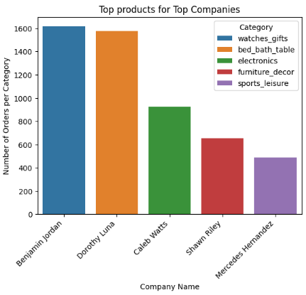
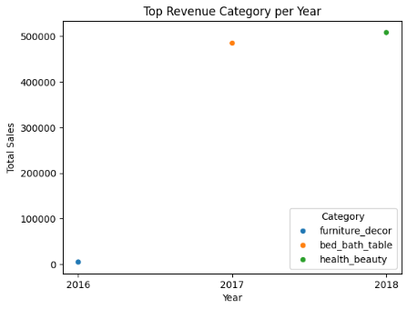
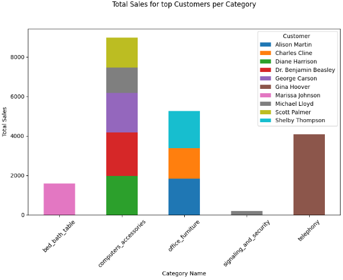
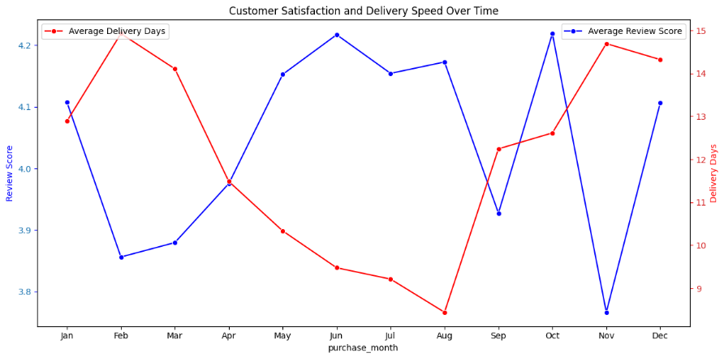

# E-commerce Data Analysis

## Project Overview

This project analyzes the **Brazilian E-Commerce Public Dataset by Olist** to extract insights on customer behavior, top products, company performance, delivery efficiency, and customer satisfaction.

## Dataset

The dataset contains multiple tables:

* **Orders** – information about customer orders and timestamps.
* **Order Reviews** – customer feedback on orders.
* **Products** – product details and categories.
* **Sellers** – seller information.
* **Customers** – customer demographics.
* **Items Ordered** – individual items in each order.

## Analysis Questions

The project aims to answer the following key questions:

1. **Customer-Seller Analysis**

   * Who are the **highest-spending customers** and which sellers do they prefer?

2. **Company-Category Analysis**

   * What is the **most frequently purchased product category in 2018** for the top companies?
   * Which **products are top-selling** for the highest-value customers?

3. **Revenue Analysis**

   * Which **product category generated the highest revenue each year**?

4. **Delivery Time Analysis**

   * Which **product categories have the fastest delivery times** and how does this vary annually?

5. **Review & Satisfaction Analysis**

   * Which **product categories are most rated each month**?
   * Is there a correlation between **delivery times and review scores**?
   * How do review scores reflect **overall customer satisfaction**?

---

## Analysis Steps

1. **Customer Analysis**

   * Identify top customers by total purchase value.
   * Visualize customer-company interactions using scatter plots or cross-tabulations.

2. **Company and Product Analysis**

   * Determine top companies by sales per year.
   * Analyze top-selling products for each company.
   * Identify the most purchased product categories per top company.
   * Visualize sales distribution using bar charts and scatter plots.

3. **Delivery Analysis**

   * Calculate delivery times in days.
   * Group data by purchase month and category to calculate mean review score and mean delivery time.
   * Identify the most rated categories each month.
   * Visualize trends using line plots or dual-axis charts.

4. **Category Performance**

   * Aggregate total sales by product category and year.
   * Highlight top revenue-generating categories.
   * Visualize trends using stacked bar charts.

5. **Review Analysis**

   * Measure mean review score per product or category to evaluate customer satisfaction.
   * Correlate review scores with delivery times.
   * Identify top-rated products and trends in customer feedback over time.

---

## Visualizations

* Scatter plots for customer-company interactions.
* Stacked bar charts for top customers by category.
* Bar charts for fastest delivery categories.
* Line plots for review score and delivery time trends per month.
* Dual-axis charts for comparing review score vs delivery speed.

## Tools & Libraries

* Python 3
* Pandas, NumPy
* Matplotlib, Seaborn
* Google Colab

## Key Insights

* Top customers and their preferred sellers.
* Companies generating the highest sales per year.
* Most frequently purchased categories per top company in 2018.
* Product categories with the fastest delivery times per year.
* Top-rated products and categories each month, including trends in customer satisfaction.
* Correlation between delivery times and review scores.

### Analysis Question 


## Questions
### 1. Who are the **highest-spending customers** and which sellers do they prefer?
  * Merge the tables to create a unified dataset for all analyses.
  * Identify the top customers by grouping data by customer_name, aggregating total sales per customer, 
    and sorting in descending order to select the top 10.
  * Filter the merged dataset to retain only records corresponding to the top customers.
  * Group the filtered data by customer name to account for multiple orders from the same company, 
   ensuring a clear view of customer-company relationships.
  * Visualize the relationships using a cross-tabulation to show which customers are associated with which companies.
  * Use a scatter plot to present the customer-company interactions in a clear and quickly understandable way.
#### The code

```
merged_data = (
        orders_df.merge(items_order_df,on="order_id",suffixes=["_order","_items"])
        .merge(sellers_df,on="seller_id",suffixes=["_orders_merge","_sellers"])
        .merge(products_df,on="product_id",suffixes=["","_products"])
        .merge(customers_df,on="customer_id",suffixes=["","_customers"])
        .merge(product_english_name_df,on="product_category_name",suffixes=["","_naming"])
)

top_customers = (

                merged_data
                .groupby(["customer_unique_id"])["price"]
                .sum()
                .sort_values(ascending=False)
                .head(10)
                .index
)
top_companies_customers = (
      merged_data.loc[merged_data["customer_unique_id"].isin(top_customers)]\
     [["customer_unique_id","company_name","customer_name"]]\
     .groupby("customer_name",as_index=False)["company_name"]\
     .unique()
)

top_companies_customers["company_name"] = top_companies_customers["company_name"].apply(lambda x: ", ".join(x))
top_companies_customers

merged_data.head(1)

# Visualize the data using a cross-tabulation to highlight the 
# relationships between customers and companies.
pd.crosstab(
    top_companies_customers["company_name"],
    top_companies_customers["customer_name"]
    )

# Visualize the customer-company relationships using a scatter plot 
# for a clear and intuitive representation.
sns.scatterplot(data=top_companies_customers,x="company_name",y="customer_name",s=100,hue="company_name")
plt.title("Number of Top Customers per Company")
plt.legend().set_visible(False)
plt.ylabel("Number of Customers")
plt.xlabel("Company")
plt.xticks(rotation=45)
plt.show()

 ```


#### Insights 
Brent Jackson and Johnny Lee appear twice, meaning these companies serve multiple top customers. 
✅ Insight: Some companies have higher engagement with top customers — could be key accounts.

Most other customers are linked to a single company. 
✅ Insight: Many top customers stick to one company, suggesting loyalty or strong preference.

Companies that serve multiple top customers (Brent Jackson, Johnny Lee) may be important revenue sources.

🎯 Strategy: Focus on these companies for retention, upselling, or special offers.

### 2. What is the **most frequently purchased product category in 2018** for the top companies?
* Steps
   * Identify the top companies for 2018:
   * Filter the dataset to include only purchases from the year 2018.
   * Group the data by company_name and aggregate by counting order_id to determine total sales per company.
   * Sort the results in descending order to rank companies by sales and select the top 5 companies.
   * Save the result in top_company_2018.
   * Analyze top products for these companies:
   * Filter the merged dataset to include only records corresponding to the top 5 companies.
   * Group the data by company_name and sort by total sales in descending order.
   * For each company, select the top-selling product to identify the key product driving sales.
 #### Code
 ```  
 top_company_2018 = (
                     merged_data[merged_data["purchase_year"]==2018]
                    .groupby("company_name")["order_id"]
                    .count()
                    .sort_values(ascending=False)
                    .head(5)
)
most_purchased_category_2018 = (
                    merged_data[merged_data["company_name"].isin(top_company_2018.index)]
                    .groupby(["company_name","product_category_name_english"])
                    .agg(orders_count= ("order_id","count"))
                    .sort_values("orders_count",ascending=False)
)
most_purchased_category_2018.groupby("company_name").head(1)

# Visualize the  Top Products Fpr Top Customers 
most_purchased_category_2018=(
    most_purchased_category_2018.
    groupby("company_name")
    .head(1)
)

sns.barplot(
    most_purchased_category_2018,
    x="company_name",
    y="orders_count",
    hue="product_category_name_english"
)

plt.ylabel("Number of Orders per Category")
plt.xlabel("Company Name")
plt.xticks(rotation=45,ha="right")
plt.title("Top products for Top Companies")
plt.legend(title="Category",loc="upper right")
plt.show()
```



#### Insights 
* Each top company appears to focus on a different product category, showing clear specialization. Benjamin Jordan → watches_gifts        Dorothy Luna → bed_bath_table Shawn Riley → furniture_decor
* Companies can optimize inventory and marketing based on their strongest category.
* Identifies opportunities for cross-promotion if a company wants to expand into categories where competitors lead.
* Each company’s most purchased category reflects what consumers prioritize per brand, useful for trend analysis.

### 3. Which **product category generated the highest revenue each year**?
   * Steps
        * Aggregate sales by year and category:
        * Group the merged dataset by purchase_year and product_category_name.
        * Aggregate the price column using sum to calculate total sales per category per year.
        * Sort the results first by purchase_year and then by price in descending order.
        * Select the top-selling category for each year to identify the category driving the highest revenue annually.
    #### Code
   
```
top_category_revenue=(
         merged_data
        .groupby(["purchase_year","product_category_name_english"])["price"].sum()
        .reset_index()
        .sort_values(["purchase_year","price"],ascending=[True,False])
)

top_category_revenue=top_category_revenue.groupby("purchase_year").head(1)
top_category_revenue


# Visualize the top revenue-generating product category for each year.
sns.scatterplot(
    data=top_category_revenue,
    x="purchase_year",
    y="price",
    hue="product_category_name_english",
)
plt.ylabel("Total Sales")
plt.legend(title="Category",loc="lower right")
plt.title("Top Revenue Category per Year")
plt.xticks(ticks=[2016,2017,2018],labels=['2016','2017','2018'])
plt.xlabel("Year")
plt.show()
   ```
 
#### 💡 Insights
  * The top revenue category changed from bed_bath_table in 2017 to health_beauty in 2018.
  * This indicates a shift in consumer demand toward health and beauty products in 2018. 
  * Businesses selling furniture and home goods may need to diversify offerings or promote new categories. 
  * Health and beauty-focused companies may capitalize on increased demand with targeted promotions.


### 4. Which **product categories have the fastest delivery times** and how does this vary annually?
 * Steps
    1. Calculate delivery time:
        * Compute the delivery time in days by subtracting the order_purchase_timestamp from the                                                  order_delivered_customer_date.
        * Store the result as a new column delivery_days.
    2. Merge and analyze data:
        * Merge the orders table with related tables such as products and items_order to create a unified dataset.        
        * Group the merged dataset by purchase_year and product_category_name.        
        * Aggregate the mean delivery time for each group.        
        * Sort the results by purchase_year in ascending order.        
        * Select the top category for each year based on the shortest average delivery time.
#### Code 

```
orders_df["delvery_days"]=round((
    orders_df["order_delivered_customer_date"]-orders_df["order_purchase_timestamp"]
).dt.days,2)


fastest_category= (
                  orders_df.merge(items_order_df,on="order_id")
                  .merge(products_df,on="product_id")
                  .merge(product_english_name_df,on="product_category_name",suffixes=["","_naming"])
                  .groupby(["purchase_year","product_category_name_english"])["delvery_days"]
                  .mean()
                  .reset_index()
                  .sort_values("purchase_year",ascending=False)
                  .reset_index()


)
fastest_category.groupby("purchase_year").head(1)

# Visualize the product categories with the fastest average delivery time for each year
fastest_category = (
    fastest_category
    .groupby("purchase_year")
    .head(1)
)

sns.barplot(
    data=fastest_category,
    x="product_category_name_english",
    y="delvery_days",
    hue="purchase_year",
    palette="viridis"
)

plt.ylabel("Delivery Time (days)")
plt.xlabel("Product Category")
plt.legend(title="Purchase Year", loc="upper right")
plt.title("Fastest Delivery per Product Category")
plt.show()
```
### 5. Identify the top-selling products for the highest-value customers.
    * Steps 
        * Filter top customers:
        * Filter the merged dataset to include only records for customers present in the top_customers list.
        * Aggregate sales by customer and category:
        * Group the filtered data by customer_id, customer_name, and product_category_name.
        * Aggregate the price column using sum to calculate total sales for each customer-category combination.
        * Sort to identify highest spending customers:
        * Sort the resulting DataFrame in descending order of total sales.
        * This reveals the top customers along with the product categories they spend the most on.
#### Code

```
customer_product_sales = (
          # Called merged dataframe then filter it to the top customers
           merged_data.loc[merged_data["customer_unique_id"].isin(top_customers)]
          .groupby(["customer_unique_id","customer_name","product_category_name_english"])["price"]
          .sum()
          .reset_index()
)

top_product_for_top_customer = (

          customer_product_sales
          .sort_values(["price"],ascending=[False])

)
top_product_for_top_customer


top_customer_product_cross_tab=(
    pd.crosstab(top_product_for_top_customer["customer_name"],
                top_product_for_top_customer["product_category_name_english"])
)
top_customer_product_cross_tab

# Visualization 

top_customer_product_fig = top_product_for_top_customer.pivot_table(
                  index="product_category_name_english",
                  columns="customer_name",
                  values="price",
                  aggfunc="sum",
                  fill_value=0
)

top_customer_product_fig.plot(kind="bar",stacked=True,figsize=(10,6))
plt.ylabel("Total Sales")
plt.xlabel("Category Name")
plt.xticks(rotation=45)
plt.title("Total Sales for top Customers per Category",y=1.1)
plt.legend(title="Customer ",loc="upper right")
plt.show()
```

  
### 6. **Review & Satisfaction Analysis**
  1. Is delivery time related to review score?
      * Steps
          * compute delivery time in days by subtracting the order purchase timestamp from the customer delivery timestamp.
          * group the merged dataset by purchase month and product category. Calculate the average review score and the                 average delivery time for each group, then sort the results by month (ascending) and review score (descending)              so the top-rated categories appear first within each month.
          * At this point, you have both the mean review score and mean delivery speed for every category across all months.
          * extract the highest-rated category in each month to identify the monthly leaders in customer satisfaction.
          * To put it all together, visualize the monthly mean review score and delivery time—using dual axes—so the                    relationship between faster delivery and higher satisfaction becomes clear on a single timeline.
#### Code
```
merged_data["delvery_days"]=round((
    merged_data["order_delivered_customer_date"]-merged_data["order_purchase_timestamp"]
).dt.days,2)


category_score_delivery = (
          merged_data
          .groupby(["purchase_month","product_category_name_english"])
          .agg(review_score=("review_score","mean"),
               delivery_speed=("delvery_days","mean"))
          .sort_values(["purchase_month","review_score"],ascending=[True,False])
          .reset_index()
)

category_score_delivery
````

### 2.Which product categories are most rated each month?
```
   # top rated categories each month 
top_categories_each_month = (
    
                            category_score_delivery
                            .groupby("purchase_month")
).head(1)
top_categories_each_month

```
### 3. What is The relationship between review score and delivery time
 ```
# Visualizing the RElationship between the review score and delivery time

category_score_delivery_monthly=(
    category_score_delivery.groupby("purchase_month")
    .agg(review_score=("review_score","mean"),
          delivery_speed=("delivery_speed","mean"))
    .reset_index()
)

fig,ax1=plt.subplots(figsize=(12,6))

sns.lineplot(
            category_score_delivery_monthly,
             x="purchase_month",
             y="review_score",
             color="blue",
             marker="o",
             label="Average Review Score",
             ax=ax1

             )

ax1.set_ylabel("Review Score",color="blue")
ax1.tick_params(axis='y', labelcolor="tab:blue", color="blue")

ax2 = ax1.twinx()
sns.lineplot(
             category_score_delivery_monthly,
             x="purchase_month",
             color="red",
             y="delivery_speed",
             marker="o",
             label="Average Delivery Days",
             ax=ax2
             )

ax2.tick_params(axis='y', labelcolor="tab:red", color="red")
ax2.set_ylabel("Delivery Days", color ="red")
plt.title("Customer Satisfaction and Delivery Speed Over Time")
plt.xlabel("Purchase Month")
plt.ylabel("Delivery Days")
plt.legend()
plt.xticks(rotation=45,ticks=range(1,13),labels=labels)
plt.legend(loc="upper left")
plt.tight_layout()
plt.show()
   ```



#### * 💡 Insights

For the highest-rated categories each month, there is no stable delivery-speed pattern. Delivery times swing widely—from about 3 days in January to 16 days in February, then dropping to around 1 day in March. This inconsistency shows that top ratings don’t necessarily depend on fast delivery for these categories.

Only a few categories appear more than once among the monthly top-rated ones. These include art (November and December), cds_dvds_musicals (2 months), books_imported (3 months), christmas_supplies (May), and cine_photo (January and February). Their repeated presence suggests sustained customer satisfaction across different periods.


